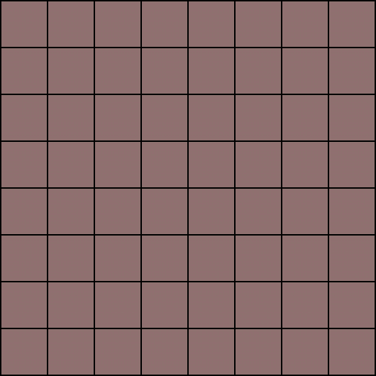
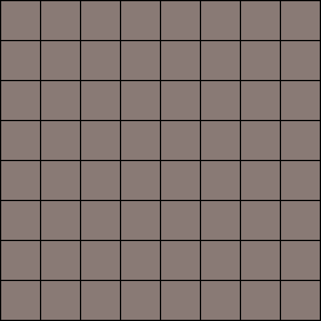

# Assignment 5: Generative Adversarial Networks (GANs)

<div align="center">
  
  
  <br>
  <em>Left: Deep Convolutional GAN | Right: Conditional Deep Convolutional GAN</em>
</div>

## 📋 Overview

This assignment focuses on implementing and training Generative Adversarial Networks (GANs) for image generation. The project implements two variants: **DCGAN** (Deep Convolutional GAN) for unconditional generation and **CDCGAN** (Conditional Deep Convolutional GAN) for class-conditional generation. Both models are trained on the AFHQ (Animal Faces-HQ) dataset to generate realistic animal face images.

## 🎯 Objectives

- Implement a fully convolutional Generator network using transposed convolutions
- Implement a fully convolutional Discriminator network for binary classification
- Train DCGAN for unconditional image generation
- Train CDCGAN for conditional image generation with class labels
- Understand adversarial training dynamics and GAN loss functions
- Visualize generated samples and monitor training progress

## 📊 Dataset

**AFHQ (Animal Faces-HQ)** - High-quality animal face dataset
- **Classes**: 3 (cats, dogs, wild animals)
- **Image size**: 64×64×3 (RGB)
- **Training/Test split**: Standard train/test split
- **Location**: `../Assignment4/data/AFHQ/`

The dataset is organized using PyTorch's `ImageFolder` structure:
```
AFHQ/
├── train/
│   ├── cat/
│   ├── dog/
│   └── wild/
└── test/
    ├── cat/
    ├── dog/
    └── wild/
```

**Data Preprocessing**:
- Resize to 64×64 pixels
- Normalize to [-1, 1] range using `transforms.Normalize([0.5]*3, [0.5]*3)`

## 🏗️ Models Implemented

### 1. Generator Network

A fully convolutional generator that maps random noise to realistic images:

**Architecture**:
- **Input**: Random noise vector `(B, latent_dim, 1, 1)` where `latent_dim=128`
- **Conditional mode**: Concatenates class embeddings with noise vector
- **Layers**: 6 transposed convolutional blocks
  - 5 blocks with BatchNorm + ReLU activation
  - Final block with Tanh activation (outputs in [-1, 1] range)
- **Output**: Generated images `(B, 3, 64, 64)`

**Channel progression**: `latent_dim → 512 → 256 → 128 → 64 → 32 → 3`

**Features**:
- Supports both conditional and unconditional modes
- Uses `ConvTranspose2d` for upsampling
- Class embeddings via `nn.Embedding` in conditional mode

### 2. Discriminator Network

A fully convolutional discriminator that classifies real vs. fake images:

**Architecture**:
- **Input**: Images `(B, 3, 64, 64)` or `(B, 4, 64, 64)` in conditional mode
- **Conditional mode**: Concatenates class embeddings as additional channel
- **Layers**: 6 convolutional blocks
  - 5 blocks with BatchNorm + LeakyReLU (slope=0.2) + Dropout (p=0.3)
  - Final block: Conv2d + Sigmoid (outputs probability)
- **Output**: Real/fake probability `(B, 1, 1, 1)`

**Channel progression**: `3 → 64 → 128 → 256 → 256 → 512 → 1`

**Features**:
- Progressive downsampling using stride-2 convolutions
- Gradient clipping (max norm=3.0) for training stability
- Binary cross-entropy loss for real/fake classification

### 3. Trainer Class

A unified training infrastructure for both GAN variants:

**Key Components**:
- Adversarial training loop with alternating generator/discriminator updates
- Binary cross-entropy loss functions
- Adam optimizers with learning rate 3e-4, betas=(0.5, 0.9)
- TensorBoard logging for losses and generated images
- Automatic image generation and visualization every 200 iterations

**Training Strategy**:
1. **Discriminator update**: Train on both real and fake images
2. **Generator update**: Train to fool the discriminator
3. **Loss balancing**: Monitor both losses to ensure stable training

## 🔬 Experiments

### DCGAN (Unconditional Generation)

**Configuration**:
- **Model**: Generator + Discriminator (unconditional)
- **Latent dimension**: 128
- **Batch size**: 64
- **Learning rate**: 1e-3
- **Epochs**: 15-50 (configurable)
- **Optimizer**: Adam (lr=3e-4, betas=(0.5, 0.9))

**Usage**:
```bash
python DCGAN.py
```

### CDCGAN (Conditional Generation)

**Configuration**:
- **Model**: Generator + Discriminator (conditional)
- **Latent dimension**: 128
- **Number of classes**: 3
- **Batch size**: 64
- **Learning rate**: 1e-3
- **Epochs**: 15-50 (configurable)
- **Conditioning**: Class labels embedded and concatenated

**Usage**:
```bash
python CDCGAN.py
```

## 🛠️ Key Features

### Loss Functions

**Discriminator Loss**:
- Real images: `BCE(pred_real, 1)` - maximize probability of real images
- Fake images: `BCE(pred_fake, 0)` - minimize probability of fake images
- Total: `D_loss = D_loss_real + D_loss_fake`

**Generator Loss**:
- `BCE(pred_fake, 1)` - maximize probability that discriminator thinks fakes are real

### Training Infrastructure

- **TensorBoard logging**: 
  - Generator loss
  - Discriminator loss (real + fake)
  - Combined loss curves
  - Generated image grids (every 200 iterations)
  
- **Model checkpointing**: Saves generator and discriminator state dicts
- **Progress tracking**: Real-time training progress with tqdm
- **Image generation**: Automatic sample generation during training

### Architecture Details

**Generator**:
- Uses `ConvTransposeBlock` with BatchNorm and ReLU
- Final layer uses Tanh to output in [-1, 1] range
- Conditional mode: Label embeddings concatenated with noise

**Discriminator**:
- Uses `ConvBlock` with BatchNorm and LeakyReLU
- Dropout (p=0.3) for regularization
- Conditional mode: Label embeddings added as spatial channel
- Gradient clipping for stability

## 📁 Project Structure

```
Assignment5/
├── DCGAN.py              # DCGAN training script
├── CDCGAN.py             # CDCGAN training script
├── models.py             # Generator, Discriminator, and Trainer classes
├── utils.py              # Utility functions (model saving, logging, etc.)
├── task1.ipynb           # Task notebook
├── Session5.ipynb        # Lab session materials
├── configs/
│   └── DCGAN1/
│       └── config.yaml   # Configuration file
├── models/               # Saved model checkpoints
├── tboard_logs/          # TensorBoard log files
│   └── gan/
├── resources/            # Educational resources
│   ├── conv.gif
│   ├── deconv.gif
│   ├── deconv.png
│   └── pixel_shuffle.pbm
├── DCGAN.gif            # DCGAN generation animation
└── CDCGAN.gif           # CDCGAN generation animation
```

## 📈 Training Process

### Training Loop

1. **Sample random noise** from latent space
2. **Generate fake images** using generator
3. **Train discriminator**:
   - Forward pass on real images → compute real loss
   - Forward pass on fake images → compute fake loss
   - Backpropagate and update discriminator
4. **Train generator**:
   - Forward pass on fake images through discriminator
   - Compute generator loss (trying to fool discriminator)
   - Backpropagate and update generator
5. **Log metrics** and generate sample images periodically

### Monitoring Training

**Key Metrics**:
- **Generator Loss**: Should decrease as generator improves
- **Discriminator Loss**: Should stabilize (not too low, not too high)
- **Loss Balance**: Both losses should be in similar ranges for stable training

**Warning Signs**:
- Discriminator loss → 0: Discriminator too strong, generator can't learn
- Generator loss → 0: Generator may be collapsing or mode dropping
- Oscillating losses: Training instability, may need to adjust learning rates

## 🚀 Usage

### Prerequisites

1. **Install dependencies**:
   ```bash
   pip install torch torchvision numpy matplotlib tqdm pyyaml tensorboard pytorch-lightning scikit-learn
   ```

2. **Download AFHQ dataset** (if not already available):
   ```bash
   cd ../Assignment4
   bash download.sh
   ```

### Running DCGAN

1. **Edit configuration** (optional):
   ```python
   configs = {
       "model_name": "DCGAN",
       "exp": "1",
       "latent_dim": 128,
       "batch_size": 64,
       "num_epochs": 50,
       "lr": 1e-3,
   }
   ```

2. **Run training**:
   ```bash
   python DCGAN.py
   ```

### Running CDCGAN

1. **Edit configuration** (optional):
   ```python
   configs = {
       "model_name": "CDCGAN",
       "exp": "1",
       "latent_dim": 128,
       "batch_size": 64,
       "num_epochs": 50,
       "lr": 1e-3,
   }
   ```

2. **Run training**:
   ```bash
   python CDCGAN.py
   ```

### Viewing TensorBoard Logs

```bash
tensorboard --logdir=tboard_logs
```

Then open `http://localhost:6006` in your browser to view:
- Training loss curves
- Generated image grids over time
- Model architecture graphs

### Loading Saved Models

```python
from models import Generator, Discriminator, Trainer
import torch

# Load checkpoint
checkpoint = torch.load('models/DCGAN1/checkpoint_DCGAN1_epoch_50.pth')

# Initialize models
generator = Generator(latent_dim=128, num_channels=3, base_channels=64)
discriminator = Discriminator(in_channels=3, out_dim=1, base_channels=64)

# Load weights
generator.load_state_dict(checkpoint['generator_state_dict'])
discriminator.load_state_dict(checkpoint['discriminator_state_dict'])

# Generate images
generator.eval()
with torch.no_grad():
    noise = torch.randn(64, 128, 1, 1)
    fake_images = generator(noise)
```

## 🔍 Key Concepts

### Transposed Convolutions

The generator uses transposed convolutions (also called deconvolutions) to upsample from low-resolution feature maps to high-resolution images. Each layer doubles the spatial dimensions while reducing channels.

### Adversarial Training

GANs use a minimax game where:
- **Discriminator** tries to maximize: `log(D(x)) + log(1 - D(G(z)))`
- **Generator** tries to minimize: `log(1 - D(G(z)))`

This creates a competitive dynamic that drives both networks to improve.

### Conditional Generation

CDCGAN extends DCGAN by:
- **Generator**: Concatenates class embeddings with noise vector
- **Discriminator**: Receives class information as additional spatial channel
- **Result**: Can generate images of specific classes on demand

## 📊 Results & Analysis

The project includes:
- **Animated GIFs**: Showing generation progress over training (DCGAN.gif, CDCGAN.gif)
- **TensorBoard visualizations**: Loss curves and generated image grids
- **Model checkpoints**: Saved at regular intervals for evaluation

### Expected Outcomes

- **DCGAN**: Generates diverse animal faces without class control
- **CDCGAN**: Generates animal faces for specific classes (cat, dog, wild)
- **Training stability**: Balanced losses indicate successful adversarial training

## 🔗 References

- [DCGAN Paper](https://arxiv.org/abs/1511.06434) - Unsupervised Representation Learning with Deep Convolutional Generative Adversarial Networks
- [Conditional GAN Paper](https://arxiv.org/abs/1411.1784) - Conditional Generative Adversarial Nets
- [AFHQ Dataset](https://github.com/clovaai/stargan-v2) - Animal Faces-HQ Dataset
- [PyTorch GAN Tutorial](https://pytorch.org/tutorials/beginner/dcgan_faces_tutorial.html)

## 💡 Tips for Training GANs

1. **Learning Rate**: Start with 2e-4 to 5e-4 for both networks
2. **Batch Size**: Use batch sizes of 64-128 for stability
3. **Normalization**: BatchNorm in generator, LayerNorm can help in discriminator
4. **Loss Monitoring**: Watch for mode collapse or discriminator overpowering generator
5. **Architecture**: Follow DCGAN guidelines (no fully connected layers, use strided convolutions)
6. **Initialization**: Use proper weight initialization (Xavier/He)

---

## 💬 Support

If you found this project helpful, you can support my work by buying me a coffee or via paypal!  

[](https://buymeacoffee.com/amirhosseinsoltani)

[](https://paypal.me/thesoltanic)

---

*This assignment demonstrates generative modeling using adversarial training, showcasing both unconditional and conditional image generation capabilities.*
