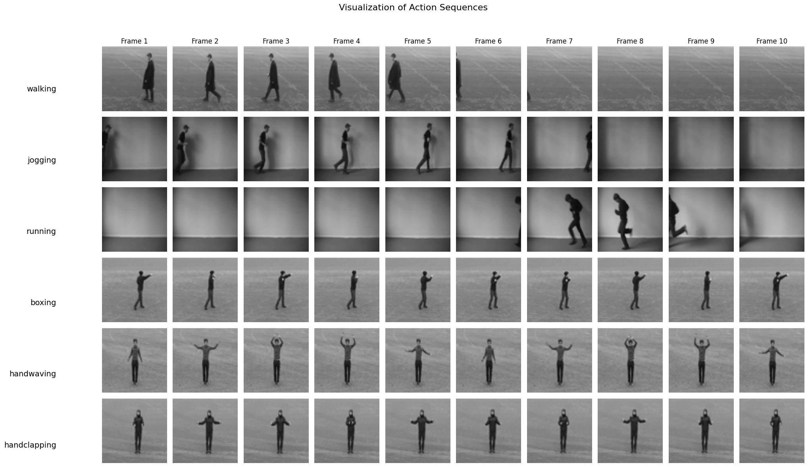

# Assignment 7: Vision Transformers for Action Recognition

## 📋 Overview

This assignment focuses on implementing and training Vision Transformers (ViT) for action recognition on the KTH-Actions dataset. The project explores transformer-based architectures for video classification, comparing different patch sizes and evaluating performance against RNN models from Assignment 3.

<div align="center">
  
  <br>
  <em>Sample output from the Vision Transformer on KTH-Actions (visualization)</em>
</div>


## 🎯 Objectives

- Implement a Vision Transformer (ViT) for action recognition on video sequences
- Process video frames by breaking them into patches and jointly processing with transformers
- Compare different patch sizes and their impact on model performance
- Evaluate ViT performance against RNN models from Assignment 3
- Explore Video Vision Transformer (ViViT) with Space-Time attention (extra credit)

## 📊 Dataset

**KTH-Actions Dataset** - 6-class action recognition dataset
- **Task**: Action recognition from video sequences
- **Classes**: walking, jogging, running, boxing, handwaving, handclapping
- **Image size**: 64×64×1 (grayscale)
- **Frame processing**: 
  - Maximum 80 frames per sequence
  - Temporal slicing with step size of 8 (resulting in 10 frames per training sample)
  - Random temporal sampling to handle dataset disparities (empty frames)
- **Split**: 
  - Training: Person IDs 0-16
  - Testing: Person IDs 17-25

The dataset is located at `/home/nfs/inf6/data/datasets/kth_actions/processed/`

## 🏗️ Models Implemented

### Vision Transformer (ViT)

A transformer-based architecture for video action recognition:

**Architecture Components**:
- **Patchifier**: Breaks each frame into patches (configurable patch size)
- **Patch Projection**: Projects patches to token dimension with LayerNorm
- **CLS Token**: Learnable classification token for each frame
- **Positional Encoding**: Adds positional information to tokens
- **Transformer Blocks**: Stack of transformer encoder blocks with:
  - Multi-Head Self-Attention
  - MLP (Feed-Forward Network)
  - Residual connections and LayerNorm
- **Classifier**: Linear layer for final classification

**Key Features**:
- Processes video sequences frame-by-frame
- Each frame is divided into patches and processed independently
- CLS tokens from all frames are averaged for final classification
- Supports configurable patch sizes, token dimensions, and number of layers

**Default Configuration**:
- **Patch size**: 16×16 (configurable: 8, 16, 32, 64)
- **Token dimension**: 192
- **Attention dimension**: 192
- **Number of heads**: 4
- **MLP size**: 768
- **Number of transformer layers**: 6
- **Number of classes**: 6

### Multi-Head Self-Attention

Implements scaled dot-product attention with multiple heads:
- Efficient head splitting and merging for batch processing
- Supports 4D input tensors (batch, sequence, tokens, dimensions)
- Attention maps can be extracted for visualization

### Transformer Block

Standard transformer encoder block:
- Multi-Head Self-Attention
- Residual connections
- Layer Normalization
- MLP with GELU activation
- Dropout for regularization

## 🔬 Experiments

The project includes experiments comparing different configurations:

| Configuration | Patch Size | Epochs | Token Dim | MLP Size | Layers |
|---------------|------------|--------|-----------|----------|--------|
| **ViT_patch_size_8** | 8×8 | 60 | 128 | 512 | 4 |
| **ViT_patch_size_16_epochs_60** | 16×16 | 60 | 192 | 768 | 6 |
| **ViT_patch_size_16_epochs_100** | 16×16 | 100 | 192 | 768 | 6 |
| **ViT_patch_size_32** | 32×32 | 60 | - | - | - |
| **ViT_patch_size_64** | 64×64 | 60 | - | - | - |

### Training Configuration

- **Optimizer**: Adam
- **Learning rate**: 3e-4
- **Batch size**: 32
- **Epochs**: 60-100 (configurable)
- **Loss function**: CrossEntropyLoss
- **Scheduler**: StepLR (step_size=10, gamma=1/3, optional)
- **Validation**: Evaluated on test set

## 🛠️ Key Features

### Data Preprocessing

**Temporal Processing**:
- Random temporal sampling: Selects 80 frames with random start index from each sequence
- Temporal slicing: Samples every 8th frame (resulting in 10 frames per sample)
- Handles dataset disparities by avoiding empty frames

**Spatial Augmentations** (Training):
- Random horizontal flip (p=0.5)
- Random rotation (±25 degrees)

**Temporal Augmentations** (Training):
- Random temporal sampling (slicing step=8)
- Random temporal reversal (p=0.3)

**Test Transforms**:
- Temporal sampling only (no augmentation)

### Training Infrastructure

- **TensorBoard logging**: Training/validation loss, accuracy, and learning rate curves
- **Model checkpointing**: Saves best models with training configurations
- **Progress tracking**: Real-time training progress with tqdm
- **Evaluation metrics**: Accuracy, loss tracking
- **Configuration management**: YAML-based config files for experiment tracking
- **Reproducibility**: Fixed random seeds for consistent results

### DataLoader

**KTHActionDataset**:
- Handles video sequence loading
- Supports train/test splits based on person IDs
- Random frame selection within sequences
- Padding for sequences shorter than max_frames
- Grayscale image conversion and resizing

## 📁 Project Structure

```
Assignment7/
├── Assignment7.ipynb          # Main assignment notebook
├── Session7.ipynb             # Lab session materials
├── models.py                  # ViT and transformer components
├── trainer.py                 # Training script
├── utils.py                   # Utility functions (training, evaluation, visualization)
├── dataloader.py              # KTHActionDataset implementation
├── transformations.py         # Data augmentation transforms
├── configs/                   # Experiment configuration files
│   ├── ViT_patch_size_16_epochs_100.yaml
│   └── ViT_patch_size_16_epochs_60.yaml
├── tboard_logs/               # TensorBoard logs
│   ├── ViT_patch_size_8_epochs_60/
│   ├── ViT_patch_size_16_epochs_60/
│   ├── ViT_patch_size_16_epochs_100/
│   ├── ViT_patch_size_32_epochs_60/
│   └── ViT_patch_size_64_epochs_60/
└── resources/                 # Reference images and documentation
    ├── vit_img.png
    ├── seminar.png
    └── ...
```

## 📈 Analysis & Results

### Model Comparison

The notebook includes comprehensive analysis:
- **Learning curves**: Training vs validation loss over epochs
- **Accuracy metrics**: Overall classification accuracy
- **Patch size comparison**: Performance across different patch sizes
- **Comparison with RNN models**: Evaluation against Assignment 3 results

### Key Findings

1. **Patch Size Impact**: Smaller patch sizes (8×8) provide more tokens per frame but increase computational cost
2. **Temporal Processing**: Averaging CLS tokens across frames effectively captures temporal information
3. **Data Handling**: Random temporal sampling helps avoid empty frames and improves training stability
4. **Transformer Architecture**: ViT shows competitive performance for action recognition tasks
5. **Attention Mechanisms**: Multi-head attention allows the model to focus on different spatial regions

## 🚀 Usage

### Setup

1. **Install dependencies**:
   ```bash
   pip install torch torchvision numpy matplotlib seaborn tqdm pyyaml tensorboard pytorch-lightning
   ```

2. **Ensure dataset is available**:
   - Dataset should be located at `/home/nfs/inf6/data/datasets/kth_actions/processed/`
   - Or modify `root_dir` in the training script

3. **Open the notebook**:
   ```bash
   jupyter notebook Assignment7.ipynb
   ```

### Running Experiments

1. **Using the Notebook**:
   - Execute cells sequentially to:
     - Load and inspect the dataset
     - Define and initialize the ViT model
     - Train with different configurations
     - Evaluate models and visualize results

2. **Using the Training Script**:
   ```bash
   python trainer.py
   ```
   - Modify configs dictionary in `trainer.py` to change hyperparameters
   - Configurations are automatically saved to YAML files

3. **Custom Configuration**:
   ```python
   configs = {   
       "model_name": "ViT",
       "batch_size": 32,
       "num_epochs": 100,
       "lr": 3e-4,
       "patch_size": 16,
       "token_dim": 192,
       "attn_dim": 192,
       "num_heads": 4,
       "mlp_size": 768,
       "num_tf_layers": 6,
       "num_classes": 6,
       "max_frames": 80,
       "slicing_step": 8
   }
   ```

### Viewing TensorBoard Logs

```bash
tensorboard --logdir=tboard_logs
```

Then open `http://localhost:6006` in your browser to view training curves.

### Loading Saved Models

```python
from utils import load_model
checkpoint = torch.load('checkpoints/checkpoint_ViT_patch_size_16_epochs_100.pth')
model.load_state_dict(checkpoint['model_state_dict'])
optimizer.load_state_dict(checkpoint['optimizer_state_dict'])
stats = checkpoint['stats']
```

## 🔧 Utility Functions

The `utils.py` file provides:

- `train_model()`: Complete training loop with TensorBoard logging
- `train_epoch()`: Training for one epoch
- `eval_model()`: Model evaluation on validation/test set
- `save_model()` / `load_model()`: Model checkpointing
- `count_model_params()`: Count learnable parameters
- `smooth()`: Loss curve smoothing for visualization
- `set_random_seed()`: Reproducibility utilities

## 🎓 Extra Credit: Video Vision Transformer (ViViT)

The assignment mentions implementing ViViT with Space-Time attention as an extra credit task. ViViT extends ViT to explicitly model temporal relationships in video sequences using space-time attention mechanisms.

**Key Differences from Standard ViT**:
- **Space-Time Attention**: Jointly attends to spatial and temporal dimensions
- **Temporal Modeling**: Explicitly models relationships between frames
- **3D Patches**: Can process spatiotemporal patches instead of frame-by-frame

Reference: [ViViT: A Video Vision Transformer](https://arxiv.org/abs/2103.15691)

## 🔗 References

- [Vision Transformer (ViT) Paper](https://arxiv.org/abs/2010.11929)
- [ViViT: A Video Vision Transformer](https://arxiv.org/abs/2103.15691)
- [KTH-Actions Dataset](https://www.csc.kth.se/cvap/actions/)
- [PyTorch Documentation](https://pytorch.org/docs/stable/index.html)
- [TensorBoard](https://www.tensorflow.org/tensorboard)
- [Attention Is All You Need](https://arxiv.org/abs/1706.03762)

---

## 💬 Support

If you found this project helpful, you can support my work by buying me a coffee or via paypal!  

[](https://buymeacoffee.com/amirhosseinsoltani)

[](https://paypal.me/thesoltanic)


*This assignment demonstrates transformer-based architectures for video action recognition, exploring how Vision Transformers can be adapted for temporal sequence modeling.*

